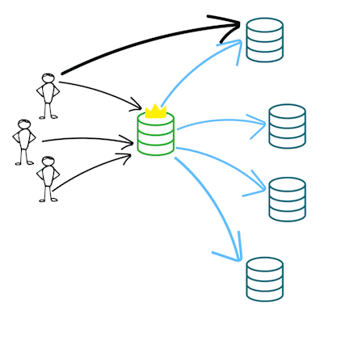
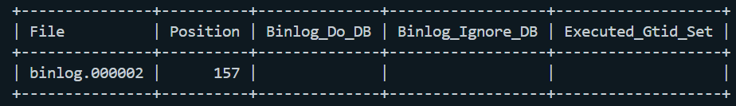

# 7. monkeDB 
MySQL Docker database replication using binary log replication and master-slave mechanism.


## I. How does it work?
The binary log contains “events” that describe database changes such as table creation operations or changes to table data. For replication, the binary log on a replication source server provides a record of the data changes to be sent to replicas. The source sends the information contained in its binary log to its replicas, which reproduce those transactions to make the same data changes that were made on the source.


## II. What this setup gives you?
This setup:
 1. Creates two credentials :\
    root (override any restrictions)
 ```
    username    : root
    password    : rootpass
 ```
    user (restricted)
 ```
    username    : user
    password    : userpass
 ```
 2. Makes the slaves read-only hence every other operation can only be done on the master database.
 3. Creates 1 master and 2 slaves results in 3 databases (and containers).

## II. How to use?
Here are the steps to setup the databases:
 1. Open docker desktop
 2. Compose the master
 ```
    docker-compose up master
 ```
 3. Open another terminal
 4. Get into the master's MySQL CLI
```
    docker exec -it master  mysql -u root -p
```
5. Enter the root password
6. Check master status
```
    SHOW MASTER STATUS;
```
7. Note the file name and the position. For example (file name and position might differ):

File name: 'binlog.000002'\
Position: 157
8. Adjust the MASTER_LOG_FILE and MASTER_LOG_POS variables in the slave.sql
```
    MASTER_LOG_FILE='binlog.000002',
    MASTER_LOG_POS=157,
```
9. Open a new terminal and compose the slaves
```
    docker-compose up slave1 slave2
```
10. Open two more terminals to check both of the slaves status
```
    docker exec -it slave1  mysql -u root -p
    {ENTER_THE_ROOT_PASSWORD}
    SHOW SLAVE STATUS\G;
```
```
    docker exec -it slave2  mysql -u root -p
    {ENTER_THE_ROOT_PASSWORD}
    SHOW SLAVE STATUS\G;
```
11. Make sure the Slave_IO_Running and Slave_SQL_Running both set to 'Yes'.
12. This setup creates an initial database called 'mydb', you can use it to test the replication process by creating a table and inserting values.
13. The databases are ready to use!


## III. Is replication just copying data?
Database replication is more than just copying data; it involves a set of processes and mechanisms to ensure that multiple database instances maintain consistency and availability. Here's a breakdown of what database replication is and how it differs from simple data copying
1. Real-time Updates:\
Replication: Data changes are propagated in real-time or near-real-time from the primary to the replicas.\
Copying: Data copying usually involves manual or scheduled processes that do not automatically update the destination after the initial copy.

2. Consistency and Synchronization:\
Replication: Ensures continuous synchronization and consistency between databases. Mechanisms like logs and binlogs track changes to maintain data consistency.\
Copying: Typically involves static snapshots of data without ongoing synchronization. The destination database may become outdated if not manually updated.

3. Failover Support:\
Replication: Often includes mechanisms for automatic failover and recovery, allowing a replica to take over if the primary fails.\
Copying: Does not inherently provide failover capabilities. Manual intervention is required to handle database failures.

4. Performance and Load Balancing:\
Replication: Can be used to distribute read operations across replicas to reduce the load on the primary database.\
Copying: Typically does not address performance issues or load balancing. Data copies are usually used for backups or migration.

5. Conflict Management:\
Replication: May involve conflict resolution strategies, especially in multi-master setups where multiple nodes can be updated concurrently.\
Copying: Does not manage conflicts since it is a one-time process or requires manual intervention.


## IV. Demonstration
[Setup a Master-Slave DB Replication with Docker and MySQL](https://www.youtube.com/watch?v=tp0bz5YybHs)


## V. References
1. [Levelup by GitConnected](https://levelup.gitconnected.com/)