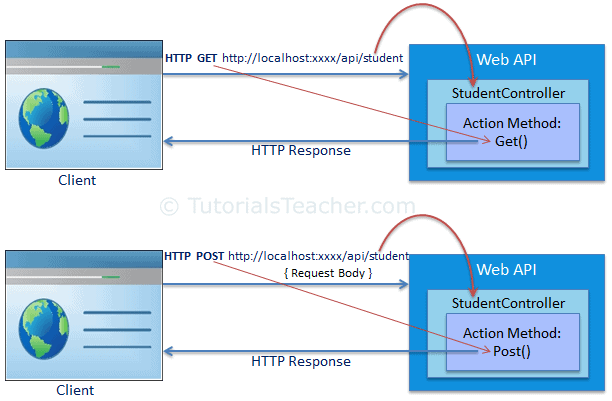

# 7. sister.JS 
Backend framework using socket in NodeJS.


## I. How does it work?
This framework handles incoming requests by:
1. Parsing the raw request.
2. Pass the request body to middlewares/route handlers.
3. Return a response with status code.

## II. Features
Here are the framework features:
1. Routing
```
app.get('/product',  Controller.getAllProduct);
```
2. Dynamic routing
```
app.get('/product/:name',  Controller.getProductByName);
```
3. Query params
```
app.get('/product?search=car',  Controller.getProductBySearch);
```
4. Handling middleware
```
app.get('/product?search=car',middleware1, middleware2, Controller.getProductBySearch);
```
5. Handle multipart/form-data content type
```
POST /user Response: {
  name: 'Wick',
  car: 'Mitsubishi',
  age: '23',
  file: {
    filename: 'image.png',
    path: 'sisterjs\\uploads\\image.png',
    contentType: 'multipart/form-data; boundary=--------------------------199875298714676838355710'   
  }
}
```
6. Customized JSON Parser
```
jsonified = parseJSON(bodyPart);
stringified = stringifyJSON(jsonData)
```

## V. References
1. [ChatGPT](https://chatgpt.com/)